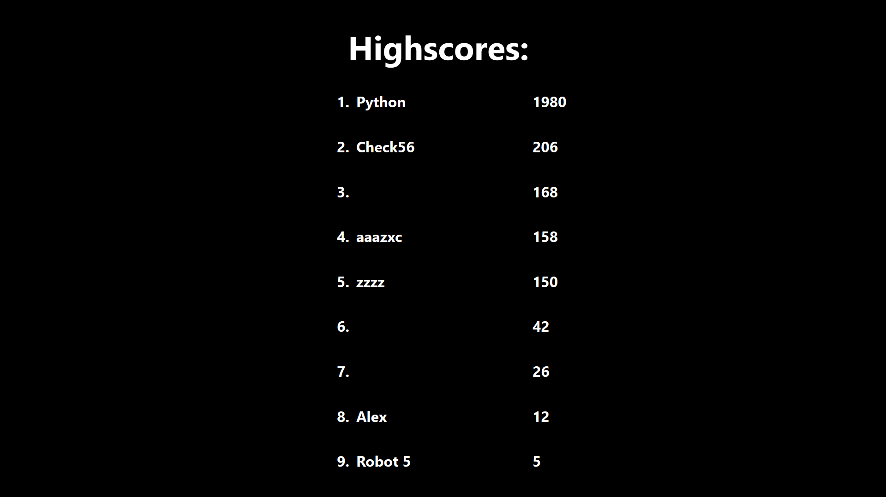

# CleanerAdventures

**CleanerAdventures** - это увлекательная игра, в которой вы управляете роботом-пылесосом, проходящим через множество
лабиринтов. Лабиринты генерируются динамически, с увеличением сложности по мере прохождения уровней. По пути вам
предстоит собирать бонусы для восстановления энергии и выбирать оптимальные маршруты для успешного завершения каждого
лабиринта.

## Описание

В игре CleanerAdventures вы управляете роботом-пылесосом, путешествующим по лабиринтам. Каждый новый уровень
представляет собой более сложный лабиринт, увеличивающийся в размере. Игра предлагает уникальный опыт благодаря
следующим особенностям:

- **Генерация лабиринтов на лету:** Каждый лабиринт создается динамически, что обеспечивает уникальность каждого уровня.
- **Возрастающая сложность:** С увеличением уровня сложность лабиринтов также возрастает.
- **Восстановление энергии:** По мере прохождения уровней, вы можете собирать бонусы, восстанавливающие энергию робота.
- **Разнообразие маршрутов:** Иногда лабиринт предоставляет несколько вариантов пути, что позволяет выбирать наиболее
  оптимальный маршрут для прохождения.

## Техническая информация

Проект реализован с использованием **PyQt**. Код представляет собой переписанную версию оригинального C++/Qt проекта на
PyQt практически без изменений. Основное внимание уделяется функциональности и обучающему процессу, что делает проект
интересным как для изучения, так и для развлечения.

## Установка и запуск

Для запуска игры потребуется Python и установленный Poetry. Следуйте инструкциям ниже для установки и запуска игры.

### Установка

1. Склонируйте репозиторий:
    ```bash
    git clone https://github.com/yourusername/CleanerAdventures.git
    cd CleanerAdventures
    ```
2. Установите Poetry, если он еще не установлен:
    ```bash
    curl -sSL https://install.python-poetry.org | python3 -
    ```
3. Установите зависимости с помощью Poetry:
    ```bash
    poetry install
    ```

### Запуск

Запустите игру командой:

```bash
poetry run python main.py
```

## Скриншоты




## Вклад в проект

Мы приветствуем вклад в проект! Если у вас есть идеи, баг-репорты или предложения, пожалуйста, создайте issue или pull
request.

## Лицензия

Этот проект лицензирован под лицензией MIT. Подробности см. в файле [LICENSE](LICENSE).

## Благодарности

Благодарим всех, кто помогал и поддерживал этот проект.

---

Надеемся, что вам понравится CleanerAdventures! Удачи в приключениях с вашим роботом-пылесосом!


